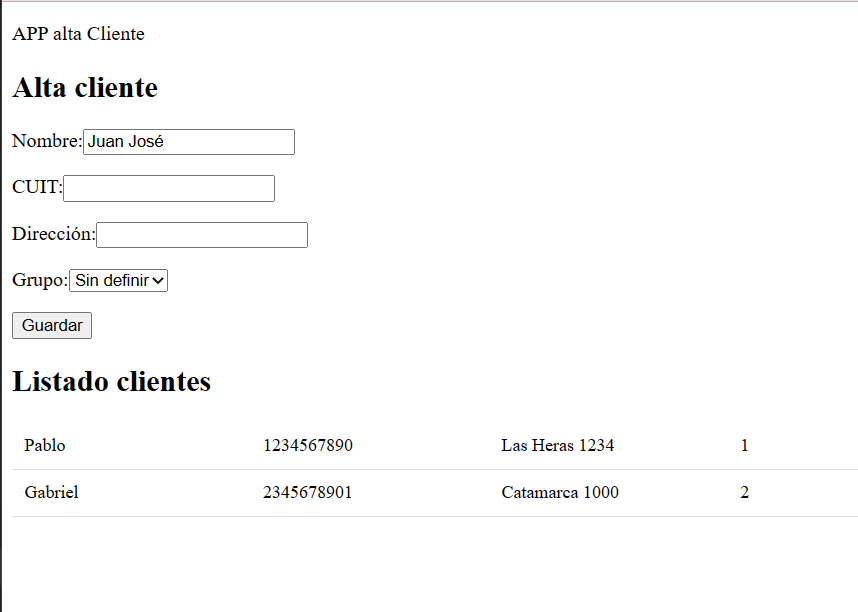

# ClientesApp

This project was generated with [Angular CLI](https://github.com/angular/angular-cli) version 15.2.6.

## Detalle de pasos seguidos en la construcción de la app
 1. Se crea el projecto mediante el comando `ng new clientes-app`
 2. Creamos el módulo de Clientes mediante `ng generate module clientes`
 3. Creamos el archivo para el modelo de datos `cliente.model.ts`
 4. Creamos el servicio para los clientes `ng generate service clientes/clientes`
 De esta forma podemos centralizar la lógica de la aplicación en un solo archivo
 5. Declarar el servicio para poder usarlo en los componentes.
 En `clientes.module.ts` importamos el servicio `import { ClientesService } from './clientes.service';` y lo declaramos en providers `providers: [ClientesService]`
 6. Creamos componente de alta de clientes `ng generate component clientes/altaCliente`
 7. En el componente recién creado `alta-cliente.component.ts`, agregamos el servicio y lo inyectamos en el constructor `import { ClientesService } from './../clientes.service';` y `constructor(private clientesService: ClientesService) { }`
 8. En el archivo `clientes.module.ts` importamos `FormsModule` para usar la directiva `ngModel` y lo agregamos al decorador `imports`
 9. En el módulo de clientes `clientes.module.ts` agregamos al `exports` el componente `AltaClienteComponent` para usar desde otros módulos
10. En el módulo raíz, `app.module.ts`, declaramos que se va a usar el componente que vienen de `clientes.module.ts`: `import { ClientesModule } from './clientes/clientes.module';`
11. Declaramos el módulo en el array de imports:
`imports: [
  BrowserModule,
  ClientesModule
],`
12. En el archivo `app.component.html` agregamos el tag `<app-alta-cliente></app-alta-cliente>`
13. Creamos el componente `ng generate component clientes/listadoClientes` y, en forma análoga realizamos los pasos 7, 8, 9, 10, 11 y 12
14. Finalmente podemos correr nuestro proyecto mediante el comando `ng serve -o`

  

